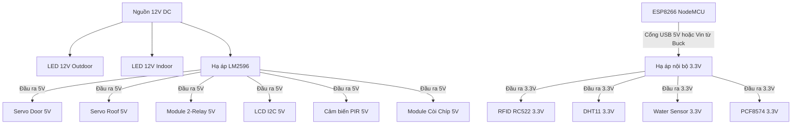

# Hướng Dẫn Đấu Nối Thiết Bị - Smart Home IoT (Phase 1)

Tài liệu này hướng dẫn chi tiết cách kết nối các linh kiện phần cứng vào **ESP8266 NodeMCU Lolin (CH340)** và bộ mở rộng I/O **PCF8574** theo yêu cầu dự án.

---

## 1. Sơ đồ GPIO Mapping

### ESP8266 NodeMCU Lolin
| Chân ESP8266 | Thiết bị | Mức điện áp | Ghi chú & Cảnh báo quan trọng |
| :--- | :--- | :--- | :--- |
| **D8 (GPIO15)** | RC522 SS (SDA) | 3.3V | Chân boot. Phải ở mức LOW khi boot. RC522 thường có pull-up, NodeMCU đã có sẵn pull-down 10k kéo lại nên hoạt động bình thường. |
| **D5 (GPIO14)** | RC522 SCK | 3.3V | Chân SPI SCK chuẩn. |
| **D7 (GPIO13)** | RC522 MOSI | 3.3V | Chân SPI MOSI chuẩn. |
| **D6 (GPIO12)** | RC522 MISO | 3.3V | Chân SPI MISO chuẩn. |
| **D0 (GPIO16)** | RC522 RST | 3.3V | Chân Reset cho RFID. |
| **D2 (GPIO4)** | I2C SDA | 3.3V | Kết nối song song đến SDA của LCD I2C và PCF8574. |
| **D1 (GPIO5)** | I2C SCL | 3.3V | Kết nối song song đến SCL của LCD I2C và PCF8574. |
| **D3 (GPIO0)** | Cảm biến DHT11 | 3.3V | Chân boot. Phải ở mức HIGH khi boot. DHT11 cần có trở pull-up (4.7k - 10k) lên 3.3V, điều này giúp ESP8266 boot bình thường. |
| **D4 (GPIO2)** | Servo Cửa (Door) | 5V (Tín hiệu 3.3V) | PWM ổn định, không bị ảnh hưởng bởi UART bootloader. |
| **A0 (ADC0)** | Water Sensor | 3.3V (VCC) | Đọc giá trị Analog từ cảm biến mưa. |
| **RX (GPIO3)** | Servo Mái (Roof) | 5V (Tín hiệu 3.3V) | **Cảnh báo**: Chân nhận dữ liệu UART. Phải gọi `Serial.end()` trong `setup()` trước `Servo.attach()`. Servo sẽ bị rung/giật khi nạp code. |
| **TX (GPIO1)** | *Không dùng* | — | Chân UART TX, không sử dụng trong cấu hình hiện tại. |

### Mạch mở rộng I2C Waveshare PCF8574 (Địa chỉ I2C mặc định thường là `0x20` hoặc `0x27` hoặc `0x3F`)
| Chân PCF8574 | Thiết bị | Ghi chú |
| :--- | :--- | :--- |
| **P0** | Module Relay 2 kênh (Kênh 1) | Điều khiển Đèn ngoài sân (Outdoor Light) - LED 12V. |
| **P1** | Module Relay 2 kênh (Kênh 2) | Điều khiển Đèn trong nhà (Indoor Light) - LED 12V. |
| **P2** | Module Còi chíp 3.4-5V | Kêu báo hiệu trạng thái (quét RFID thành công/thất bại). |
| **P3** | Cảm biến PIR | Phát hiện chuyển động (khi ở chế độ tối ưu chân). |
| **P4** | Module Relay 1 kênh | Điều khiển Động cơ DC 5V (Quạt thông minh - Smart Fan). |
| **P5 - P7** | Trống | Sử dụng mở rộng trong tương lai. |

---

## 2. Thiết kế Nguồn Cấp (Power Supply)

Hệ thống sử dụng 3 mức điện áp nguồn khác nhau. Cần đi chung dây **GND (Ground)** của tất cả các nguồn để đồng bộ tín hiệu điều khiển.

> [!IMPORTANT]
> **Quy tắc về Ground (GND):** 
> Dây âm (GND) của nguồn 12V, nguồn 5V (sau LM2596), và chân GND của ESP8266 **bắt buộc** phải nối chung với nhau. Nếu không chung GND, tín hiệu điều khiển Servo, Relay và các cảm biến sẽ bị nhiễu hoặc không hoạt động.

---

## 3. Các Lưu Ý Quan Trọng Khi Lắp Đặt & Lập Trình

### 1. Hiện Tượng Rung Giật Servo Ở Chân RX/TX
*   **Nguyên nhân**: Chân RX (GPIO3) và TX (GPIO1) được dùng cho giao tiếp Serial (để nạp code và debug). Khi ESP8266 khởi động, chip sẽ gửi các gói tin bootloader ra chân TX, đồng thời cổng USB-to-UART sẽ giữ chân RX ở mức cao. Điều này tạo ra các xung tín hiệu giả lập PWM khiến các Servo MG90S tự động xoay hoặc rung lắc mạnh.
*   **Giải pháp phần cứng**: 
    - Rút kết nối Servo ra khi nạp code.
    - Hoặc thêm trở kéo xuống (pull-down) khoảng 4.7K - 10K từ chân tín hiệu Servo xuống GND để hạn chế nhiễu, tuy nhiên cách này không triệt tiêu hoàn toàn xung bootloader.
*   **Giải pháp phần mềm**: 
    - Trong code, gọi `Serial.end()` ngay đầu hàm `setup()` trước khi khởi tạo Servo để tránh xung UART đè lên tín hiệu điều khiển Servo.
    - Cách tốt nhất (nếu có thể thay đổi thiết kế): Chuyển cảm biến PIR (D4) và DHT11 (D3) sang chân của **PCF8574**, từ đó giải phóng chân **D3, D4** của ESP8266 để điều khiển 2 Servo. Việc điều khiển Servo trực tiếp từ GPIO của ESP8266 sẽ ổn định hơn rất nhiều so với dùng chân RX/TX.

### 2. Mức Điện Áp Tín Hiệu (Logic Level) của LCD và Relay
*   Màn hình LCD I2C và Module Relay hoạt động ở **5V**, nhưng chân I2C (D1, D2) của ESP8266 hoạt động ở **3.3V**.
*   **LCD I2C**: May mắn là hầu hết các mạch I2C Backpack của LCD 1602/2004 nhận tín hiệu 3.3V rất tốt khi được cấp nguồn 5V. Bạn có thể nối trực tiếp SDA (D2) và SCL (D1) vào LCD.
*   **Relay Module**: Sử dụng module Relay loại **Active Low** (Kích ở mức THẤP) cấp nguồn 5V. Tín hiệu điều khiển từ PCF8574 (chạy ở 3.3V hoặc 5V) sẽ kích hoạt Relay dễ dàng mà không cần mạch chuyển đổi mức logic.

### 3. Cảm biến Nước (Water Sensor)
*   Water Sensor có thể chạy từ 3.3V - 5V. Khuyên dùng **3.3V** cấp từ ESP8266 để tín hiệu Analog ngõ ra dao động từ `0V - 3.3V`, phù hợp hoàn hảo với dải đo của chân **A0** trên ESP8266 NodeMCU (được thiết kế sẵn mạch chia áp trên board để nhận tối đa 3.3V).
